# 🏗️ NexPay — Payment & Reward System: Complete High-Level Design

> **Project**: Capgemini Java Full-Stack Payment & Reward System
> **Tech Stack**: Spring Boot 3.3.2 · Spring Cloud 2023.0.3 · Angular · PostgreSQL · RabbitMQ · Redis · Docker · AWS · Terraform
> **Architecture**: Microservices with Event-Driven, CQRS, and Saga Patterns

---

## 📌 1. System Overview — एक नज़र में पूरा System

यह एक **Digital Wallet & Payment System** है जो **11 Microservices** पर बना है। इसमें users wallet में पैसे add कर सकते हैं, transfer कर सकते हैं, payments कर सकते हैं, rewards earn कर सकते हैं, और KYC verification करा सकते हैं। Admin panel से system manage होता है।

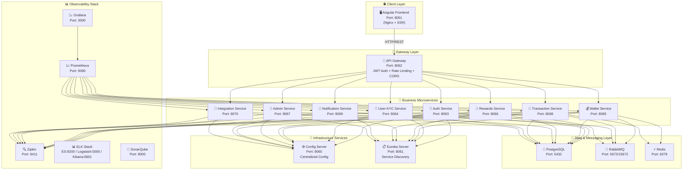

---

## 📌 2. Service Port Map — कौन कहाँ चल रहा है

| #  | Service | Port | Role |
|----|---------|------|------|
| 1  | **Config Server** | `8060` | Centralized configuration (Native + Git) |
| 2  | **Eureka Server** | `8061` | Service Discovery & Registration |
| 3  | **API Gateway** | `8062` | Routing, JWT Auth, CORS, Rate Limiting |
| 4  | **Auth Service** | `8063` | Signup, Login, JWT Token, OTP |
| 5  | **User-KYC Service** | `8064` | User Profile, KYC Submit/Verify |
| 6  | **Wallet Service** | `8065` | Balance, Top-up, Transfer, Ledger |
| 7  | **Rewards Service** | `8066` | Reward Points, Catalog, Redeem |
| 8  | **Admin Service** | `8067` | KYC Approval, Campaigns, Dashboard |
| 9  | **Transaction Service** | `8068` | Payments, Refunds, History, Disputes, Statements |
| 10 | **Notification Service** | `8069` | Email/SMS/Push, Device Tokens |
| 11 | **Integration Service** | `8070` | External Payment Gateway, KYC Verification |
| 12 | **Frontend (Angular)** | `8051` | User-facing SPA (Nginx) |
| — | PostgreSQL | `5432` | Shared relational database |
| — | RabbitMQ | `5672` / `15672` | Async messaging / Management UI |
| — | Redis | `6379` | Caching + Idempotency keys |
| — | Zipkin | `9411` | Distributed tracing |
| — | Elasticsearch | `9200` | Log storage |
| — | Logstash | `5000` / `5044` | Log ingestion pipeline |
| — | Kibana | `5601` | Log visualization |
| — | Prometheus | `9090` | Metrics collection |
| — | Grafana | `3000` | Metrics dashboards |
| — | SonarQube | `9000` | Code quality analysis |

---

## 📌 3. Complete Architecture Diagram — पूरा Architecture

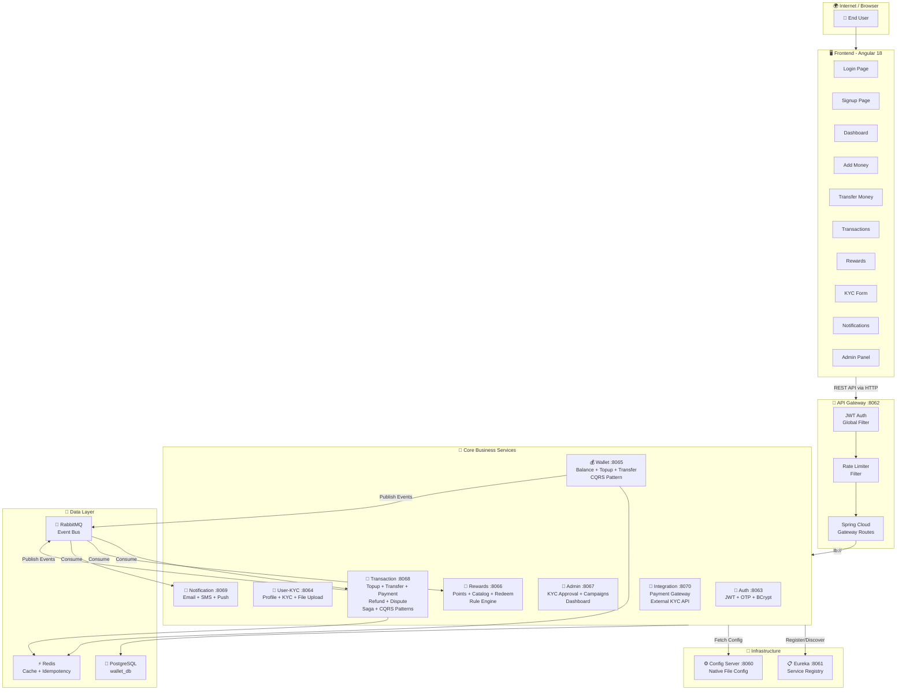

---

## 📌 4. Database Schema (Entity Map) — कौन सा Data कहाँ Store होता है

```mermaid
erDiagram
    AUTH_USER {
        Long id PK
        String username
        String password
        String role
        String email
        String phone
    }

    OTP_ENTITY {
        Long id PK
        String target
        String otp
        LocalDateTime expiry
    }

    USER_PROFILE {
        Long id PK
        String fullName
        String email
        String phone
        String kycStatus
        String documentId
        String documentUrl
    }

    WALLET_ACCOUNT {
        Long id PK
        Long userId FK
        BigDecimal balance
    }

    WALLET_LIMIT_CONFIG {
        Long id PK
        BigDecimal maxTopup
        BigDecimal maxTransfer
        BigDecimal dailyLimit
    }

    LEDGER_ENTRY_WALLET {
        Long id PK
        Long walletId FK
        String type
        BigDecimal amount
        LocalDateTime timestamp
    }

    TRANSACTION {
        Long id PK
        Long userId FK
        String type
        BigDecimal amount
        String status
        String referenceId
        LocalDateTime createdAt
    }

    LEDGER_ENTRY_TXN {
        Long id PK
        Long transactionId FK
        String action
        BigDecimal amount
    }

    DISPUTE {
        Long id PK
        Long transactionId FK
        Long userId FK
        String reason
        String status
        String resolution
    }

    REWARDS_ACCOUNT {
        Long id PK
        Long userId FK
        Integer pointsBalance
    }

    REWARDS_TRANSACTION {
        Long id PK
        Long accountId FK
        String type
        Integer points
        LocalDateTime timestamp
    }

    REWARD_RULE_CONFIG {
        Long id PK
        BigDecimal pointsPerRupee
        BigDecimal bonusMultiplier
    }

    REWARD_CATALOG_ITEM {
        Long id PK
        String name
        Integer pointsCost
        Long merchantId
    }

    NOTIFICATION_MESSAGE {
        Long id PK
        Long userId FK
        String channel
        String subject
        String body
        String status
    }

    DEVICE_TOKEN {
        Long id PK
        Long userId FK
        String token
        String platform
    }

    PAYMENT_TRANSACTION {
        Long id PK
        String paymentRef
        BigDecimal amount
        String status
        String gateway
    }

    KYC_VERIFICATION {
        Long id PK
        Long userId FK
        String documentId
        String verificationStatus
    }

    CAMPAIGN {
        Long id PK
        String name
        String description
        Boolean active
        LocalDateTime startDate
        LocalDateTime endDate
    }

    ADMIN_ACTION {
        Long id PK
        String actionType
        String description
        LocalDateTime timestamp
    }

    AUTH_USER ||--o{ OTP_ENTITY : "generates"
    USER_PROFILE ||--|| WALLET_ACCOUNT : "owns"
    WALLET_ACCOUNT ||--o{ LEDGER_ENTRY_WALLET : "has"
    USER_PROFILE ||--o{ TRANSACTION : "initiates"
    TRANSACTION ||--o{ LEDGER_ENTRY_TXN : "has"
    TRANSACTION ||--o{ DISPUTE : "may have"
    USER_PROFILE ||--|| REWARDS_ACCOUNT : "has"
    REWARDS_ACCOUNT ||--o{ REWARDS_TRANSACTION : "earns/redeems"
    USER_PROFILE ||--o{ NOTIFICATION_MESSAGE : "receives"
    USER_PROFILE ||--o{ DEVICE_TOKEN : "registers"
    USER_PROFILE ||--o{ KYC_VERIFICATION : "verifies via"
```

---

## 📌 5. Inter-Service Communication — Services एक दूसरे से कैसे बात करते हैं

### 5a. Synchronous (Feign Clients — REST over HTTP)

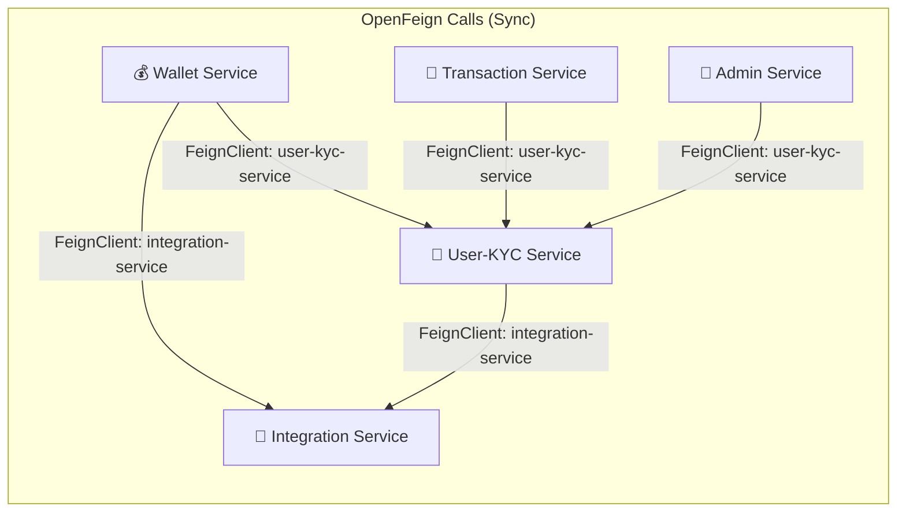

| Source Service | Target Service | Purpose |
|----------------|----------------|---------|
| **Wallet** → **User-KYC** | User verification before wallet ops |
| **Wallet** → **Integration** | External payment gateway for top-up |
| **Transaction** → **User-KYC** | Validate user before transactions |
| **Admin** → **User-KYC** | KYC approval/rejection management |
| **User-KYC** → **Integration** | External KYC document verification |

### 5b. Asynchronous (RabbitMQ — Event-Driven)

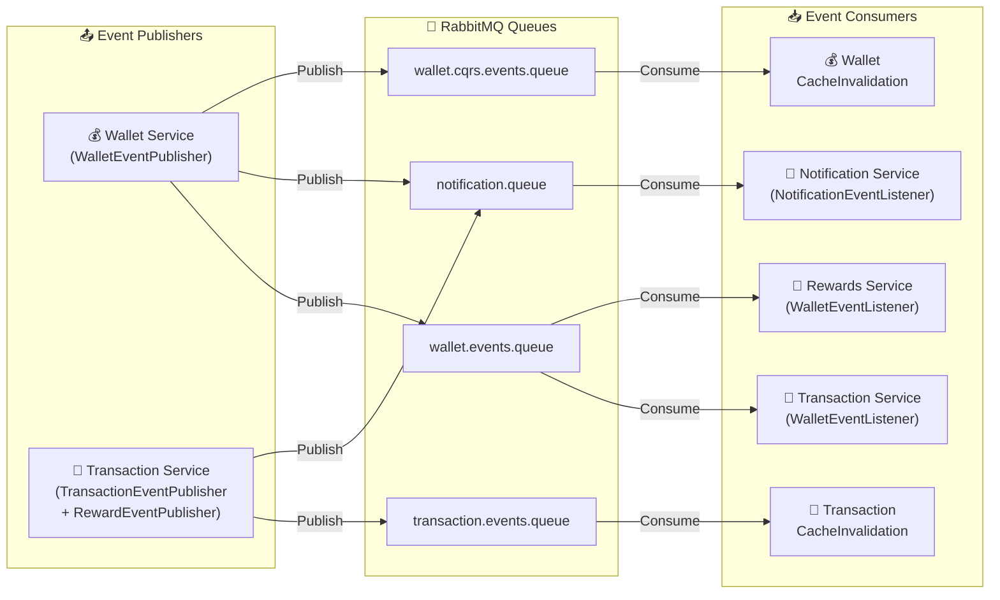

| Queue | Publisher | Consumer | Event Purpose |
|-------|-----------|----------|---------------|
| `wallet.events.queue` | Wallet Service | Transaction Service, Rewards Service | Wallet balance changes → Log transaction, Earn reward points |
| `notification.queue` | Wallet, Transaction, User-KYC, Rewards | Notification Service | Send email/SMS/push notification |
| `transaction.events.queue` | Transaction Service | Transaction Cache Invalidation | Invalidate Redis cache on new transactions |
| `wallet.cqrs.events.queue` | Wallet Service | Wallet Cache Invalidation | CQRS read-model cache invalidation |

---

## 📌 6. Design Patterns Used — कौन से Patterns लगे हैं

### 6a. 🔄 CQRS (Command Query Responsibility Segregation)

Wallet Service और Transaction Service दोनों में CQRS implement है:

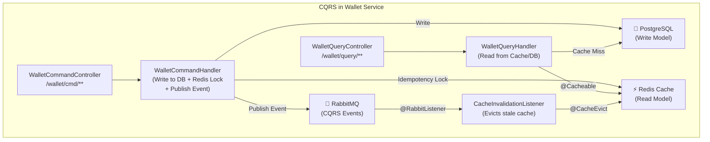

> **Key Point**: Writes go to PostgreSQL + publish events. Reads are served from Redis cache. Cache is invalidated via RabbitMQ events.

### 6b. 🔄 Saga Pattern (Orchestration-based)

Transaction Service में Payment flow को Saga Pattern से manage किया गया है:

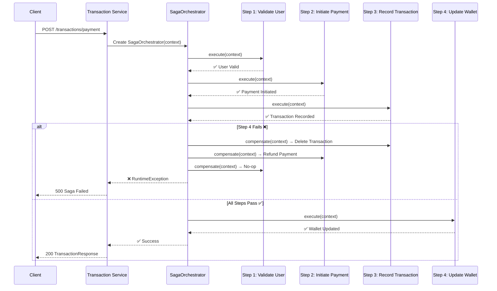

### 6c. Other Patterns

| Pattern | Where Used | Purpose |
|---------|-----------|---------|
| **API Gateway** | `api-gateway` | Single entry point, routing, auth |
| **Service Discovery** | `eureka-server` | Dynamic service registration |
| **Centralized Config** | `config-server` | Externalized configuration |
| **Circuit Breaker Ready** | Feign Clients | Resilience via Spring Cloud |
| **Event-Driven** | RabbitMQ | Loose coupling between services |
| **Idempotency** | Redis `setIfAbsent` in Wallet | Prevent duplicate transactions |
| **RBAC** | API Gateway JWT Filter | Role-based access (USER, ADMIN, SUPPORT, MERCHANT) |

---

## 📌 7. Security Architecture — Security कैसे Handle होती है

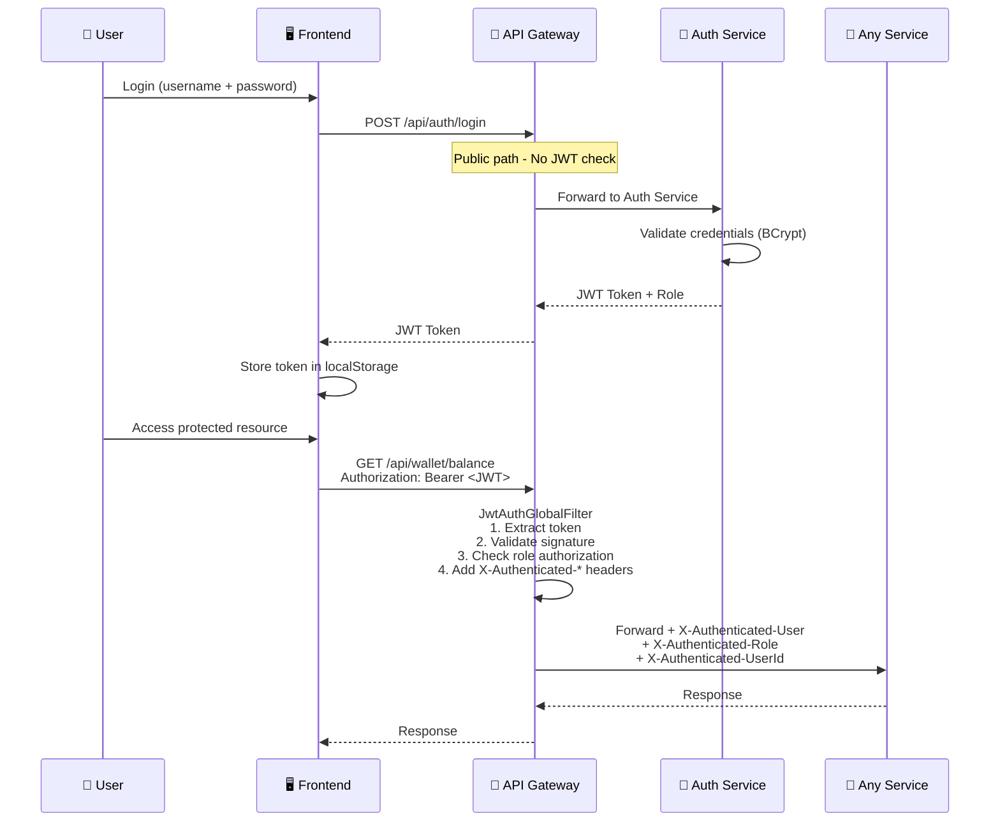

### Role-Based Access Control (RBAC)

| Role | Accessible Routes |
|------|-------------------|
| **USER** | `/api/wallet/**`, `/api/transactions/**`, `/api/rewards/**`, `/api/kyc/**`, `/api/notifications/**` |
| **ADMIN** | All USER routes + `/api/admin/**`, `/api/wallet/admin/**`, `/api/rewards/admin/**`, `/api/kyc/pending`, `/api/disputes/*/resolve` |
| **SUPPORT** | All USER routes + `/api/support/**`, `/api/disputes/*/escalate` |
| **MERCHANT** | All USER routes + `/api/merchant/**`, `/api/rewards/merchant/**` |

---

## 📌 8. API Gateway Routing Map — Request कहाँ जाती है

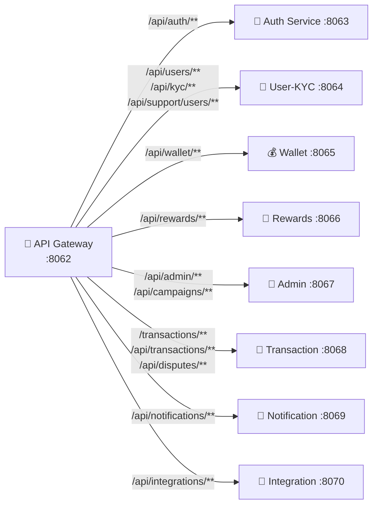

---

## 📌 9. Complete API Endpoints — सारे APIs

### 🔐 Auth Service (`/api/auth`)
| Method | Endpoint | Description |
|--------|----------|-------------|
| `POST` | `/api/auth/signup` | Register new user |
| `POST` | `/api/auth/login` | Login & get JWT token |
| `POST` | `/api/auth/otp/generate` | Generate OTP |
| `POST` | `/api/auth/otp/verify` | Verify OTP |
| `GET` | `/api/auth/test` | Health check |

### 👤 User-KYC Service (`/api/users`, `/api/kyc`)
| Method | Endpoint | Description |
|--------|----------|-------------|
| `POST` | `/api/users` | Create user profile |
| `GET` | `/api/users/{id}` | Get user profile |
| `POST` | `/api/kyc/submit/{userId}` | Submit KYC with document ID |
| `POST` | `/api/kyc/upload/{userId}` | Submit KYC with file upload |
| `PUT` | `/api/kyc/{userId}/status` | Update KYC status (ADMIN) |
| `GET` | `/api/kyc/pending` | List pending KYC (ADMIN) |

### 💰 Wallet Service (`/api/wallet`)
| Method | Endpoint | Description |
|--------|----------|-------------|
| `GET` | `/api/wallet/balance?userId=` | Get wallet balance |
| `POST` | `/api/wallet/topup` | Direct top-up |
| `POST` | `/api/wallet/topup/init` | Init payment gateway top-up |
| `POST` | `/api/wallet/topup/confirm/{ref}` | Confirm payment top-up |
| `POST` | `/api/wallet/transfer` | Wallet-to-wallet transfer |
| `GET` | `/api/wallet/transactions?userId=` | Transaction history |
| `GET` | `/api/wallet/admin/limits` | Get limits (ADMIN) |
| `POST` | `/api/wallet/admin/limits` | Update limits (ADMIN) |

### 💸 Transaction Service (`/transactions`)
| Method | Endpoint | Description |
|--------|----------|-------------|
| `POST` | `/transactions/topup` | Record top-up transaction |
| `POST` | `/transactions/transfer` | Record transfer transaction |
| `POST` | `/transactions/payment` | Payment via Saga pattern |
| `POST` | `/transactions/refund` | Process refund |
| `GET` | `/transactions/id/{id}` | Get transaction by ID |
| `GET` | `/transactions/user/{userId}` | Get user transactions |
| `GET` | `/transactions/history?from=&to=` | Date-range history |
| `GET` | `/transactions/{id}/receipt` | Download PDF receipt |
| `GET` | `/transactions/statement` | Download PDF/CSV statement |

### 💬 Dispute Management (`/api/disputes`)
| Method | Endpoint | Description |
|--------|----------|-------------|
| `POST` | `/api/disputes` | Create dispute |
| `GET` | `/api/disputes?userId=` | List user disputes |
| `GET` | `/api/support/disputes/open` | Open disputes (SUPPORT) |
| `PUT` | `/api/disputes/{id}/escalate` | Escalate dispute (SUPPORT) |
| `PUT` | `/api/disputes/{id}/resolve` | Resolve dispute (ADMIN) |

### 🎁 Rewards Service (`/api/rewards`)
| Method | Endpoint | Description |
|--------|----------|-------------|
| `GET` | `/api/rewards/summary?userId=` | Reward points summary |
| `GET` | `/api/rewards/catalog` | Reward catalog items |
| `POST` | `/api/rewards/redeem` | Redeem rewards |
| `GET` | `/api/rewards/admin/rules` | Get reward rules (ADMIN) |
| `POST` | `/api/rewards/admin/rules` | Update reward rules (ADMIN) |
| `POST` | `/api/rewards/merchant/items` | Create catalog item (MERCHANT) |
| `GET` | `/api/rewards/merchant/items?merchantId=` | Merchant items |

### 🔔 Notification Service (`/api/notifications`)
| Method | Endpoint | Description |
|--------|----------|-------------|
| `POST` | `/api/notifications/send` | Send notification |
| `GET` | `/api/notifications/history?userId=` | Notification history |
| `POST` | `/api/notifications/device-token` | Register device token |
| `GET` | `/api/notifications/admin/stats` | Stats (ADMIN) |

### 🔗 Integration Service (`/api/integrations`)
| Method | Endpoint | Description |
|--------|----------|-------------|
| `POST` | `/api/integrations/payments/init` | Init external payment |
| `PUT` | `/api/integrations/payments/{ref}/status` | Update status (ADMIN) |
| `GET` | `/api/integrations/payments/{ref}` | Payment status |
| `POST` | `/api/integrations/payments/{ref}/refund` | Refund payment |
| `POST` | `/api/integrations/kyc/verify` | External KYC verification |

### 👑 Admin Service (`/api/admin`)
| Method | Endpoint | Description |
|--------|----------|-------------|
| `GET` | `/api/admin/kyc/pending` | Pending KYC list |
| `POST` | `/api/admin/kyc/{userId}/approve` | Approve/Reject KYC |
| `POST` | `/api/admin/campaigns` | Create campaign |
| `GET` | `/api/admin/campaigns` | List campaigns |
| `PATCH` | `/api/admin/campaigns/{id}` | Update campaign |
| `DELETE` | `/api/admin/campaigns/{id}` | Delete campaign |
| `POST` | `/api/admin/campaigns/{id}/activate` | Activate campaign |
| `POST` | `/api/admin/campaigns/{id}/deactivate` | Deactivate campaign |
| `GET` | `/api/admin/dashboard` | Admin dashboard data |

---

## 📌 10. Payment Flow (End-to-End) — पैसा कैसे move होता है

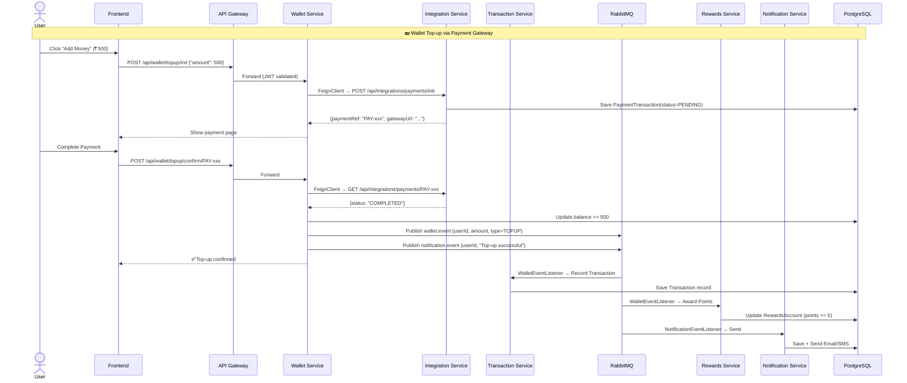

---

## 📌 11. Frontend Architecture — Angular App कैसे बना है

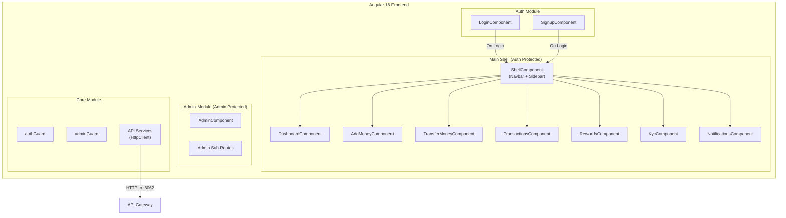

### Frontend Routes

| Path | Component | Guard |
|------|-----------|-------|
| `/login` | LoginComponent | — |
| `/signup` | SignupComponent | — |
| `/dashboard` | DashboardComponent | authGuard |
| `/wallet/add-money` | AddMoneyComponent | authGuard |
| `/wallet/transfer` | TransferMoneyComponent | authGuard |
| `/transactions` | TransactionsComponent | authGuard |
| `/rewards` | RewardsComponent | authGuard |
| `/kyc` | KycComponent | authGuard |
| `/notifications` | NotificationsComponent | authGuard |
| `/admin/**` | AdminComponent | adminGuard |

---

## 📌 12. Observability & Monitoring — System को कैसे Monitor करते हैं

```mermaid
flowchart LR
    subgraph "📊 Observability Stack"
        direction TB
        subgraph "Distributed Tracing"
            SVC["All 8 Services"] -->|"Trace spans"| ZIP["🔍 Zipkin :9411<br/>Micrometer Brave"]
        end

        subgraph "Centralized Logging"
            SVC2["All Services"] -->|"Log output"| LS["Logstash :5000"]
            LS --> EL["Elasticsearch :9200"]
            EL --> KB["Kibana :5601"]
        end

        subgraph "Metrics & Alerting"
            PR["Prometheus :9090"] -->|"Scrape /actuator/prometheus"| SVC3["All 11 Services"]
            GR["Grafana :3000"] -->|"Query"| PR
        end

        subgraph "Code Quality"
            SQ["SonarQube :9000"] -->|"JaCoCo Reports"| COV["Code Coverage"]
        end
    end
```

| Tool | Purpose | Port |
|------|---------|------|
| **Zipkin** | Request tracing across services | `9411` |
| **ELK Stack** | Centralized log aggregation | `9200/5000/5601` |
| **Prometheus** | Metrics collection (scrapes `/actuator/prometheus`) | `9090` |
| **Grafana** | Visualization dashboards | `3000` |
| **SonarQube** | Code quality + test coverage (JaCoCo) | `9000` |

---

## 📌 13. Deployment Architecture — Production में कैसे Deploy होता है

```mermaid
flowchart TB
    subgraph "☁️ AWS Cloud"
        subgraph "Terraform Managed"
            EC2["🖥️ EC2 Instance<br/>Ubuntu 22.04<br/>t2.micro / t3.medium<br/>gp3 EBS Volume"]
        end

        subgraph "EC2 Instance internals"
            DOCKER["🐳 Docker Compose<br/>(22 containers)"]
            DOCKER --> FE_C["Frontend :8051"]
            DOCKER --> GW_C["API Gateway :8062"]
            DOCKER --> CS_C["Config Server :8060"]
            DOCKER --> ES_C["Eureka :8061"]
            DOCKER --> AUTH_C["Auth :8063"]
            DOCKER --> KYC_C2["User-KYC :8064"]
            DOCKER --> WAL_C["Wallet :8065"]
            DOCKER --> REW_C["Rewards :8066"]
            DOCKER --> ADM_C["Admin :8067"]
            DOCKER --> TXN_C2["Transaction :8068"]
            DOCKER --> NOT_C2["Notification :8069"]
            DOCKER --> INT_C2["Integration :8070"]
            DOCKER --> PG_C["PostgreSQL :5432"]
            DOCKER --> RMQ_C["RabbitMQ :5672"]
            DOCKER --> RD_C["Redis :6379"]
            DOCKER --> ZIP_C["Zipkin :9411"]
            DOCKER --> ELK_C["ELK Stack"]
            DOCKER --> PROM_C["Prometheus :9090"]
            DOCKER --> GRAF_C["Grafana :3000"]
            DOCKER --> SQ_C["SonarQube :9000"]
        end

        SG["🔒 Security Group<br/>Ports: 22, 5432, 8051-8070, 15672"]
        KP["🔑 SSH Key Pair<br/>(Terraform Generated)"]
    end

    subgraph "🐳 Docker Hub"
        HUB["shashwattech/<br/>capgemini_javafullstack_done"]
    end

    DEV["👨‍💻 Developer"] -->|"terraform apply"| EC2
    DEV -->|"docker push"| HUB
    EC2 -->|"docker pull"| HUB
    INET["🌐 Internet Users"] -->|"HTTP :8051"| FE_C
    INET -->|"API :8062"| GW_C
```

---

## 📌 14. Service Startup Order — Services किस Order में Start होते हैं

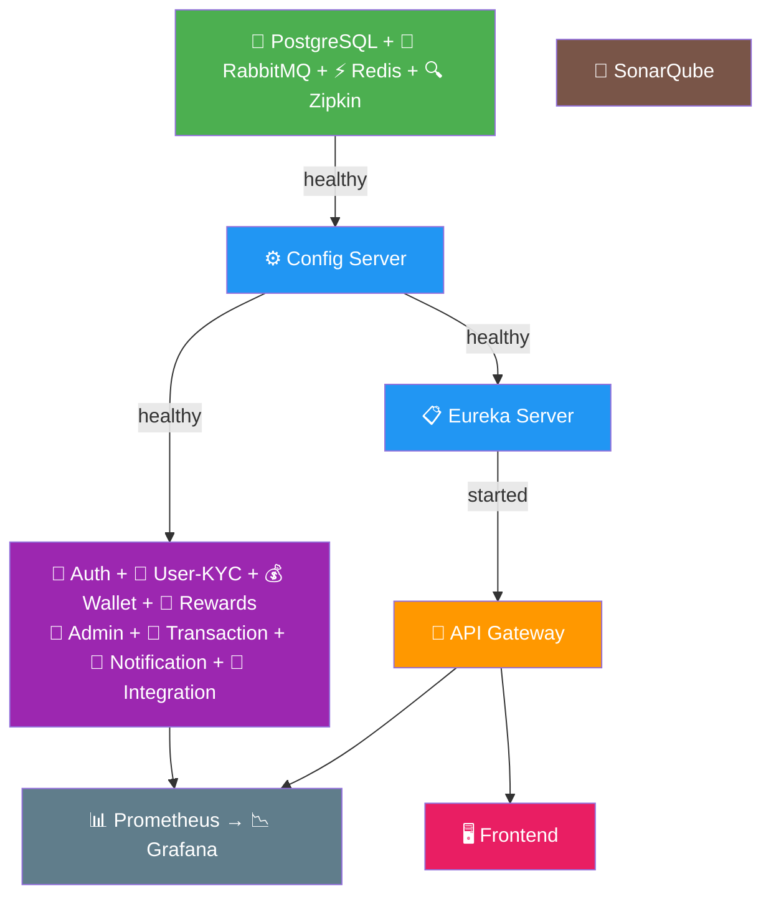

---

## 📌 15. Tech Stack Summary — पूरा Technology Stack

| Layer | Technology | Version |
|-------|------------|---------|
| **Language** | Java | 17 |
| **Backend Framework** | Spring Boot | 3.3.2 |
| **Cloud Framework** | Spring Cloud | 2023.0.3 |
| **API Gateway** | Spring Cloud Gateway | — |
| **Service Discovery** | Netflix Eureka | — |
| **Config Management** | Spring Cloud Config | Native |
| **Inter-service Comm.** | OpenFeign | — |
| **Messaging** | RabbitMQ | Latest |
| **Caching** | Redis | 7 Alpine |
| **Database** | PostgreSQL | 15+ |
| **ORM** | Spring Data JPA / Hibernate | — |
| **Security** | JWT (jjwt) + BCrypt | — |
| **Tracing** | Micrometer + Brave + Zipkin | — |
| **Monitoring** | Prometheus + Grafana | — |
| **Logging** | ELK Stack | 7.17.16 |
| **Code Quality** | SonarQube + JaCoCo | 9.9 / 0.8.12 |
| **Frontend** | Angular | 18 |
| **CSS** | SCSS + TailwindCSS | — |
| **Containerization** | Docker + Docker Compose | — |
| **IaC** | Terraform + AWS | ~5.0 |
| **Cloud** | AWS EC2 (Ubuntu 22.04) | — |
| **CI/CD** | GitHub Actions | — |
| **Build Tool** | Maven (Multi-module) | — |
| **API Docs** | SpringDoc OpenAPI (Swagger UI) | — |

---

> [!IMPORTANT]
> **Total Containers in Production**: 22 containers running on a single EC2 instance via Docker Compose — including 11 microservices + Frontend + 5 data/messaging stores + 5 observability tools.

> [!TIP]
> **Design Patterns Used**: API Gateway, Service Discovery, Centralized Config, CQRS, Saga (Orchestration), Event-Driven Architecture, RBAC, Idempotency Keys.
